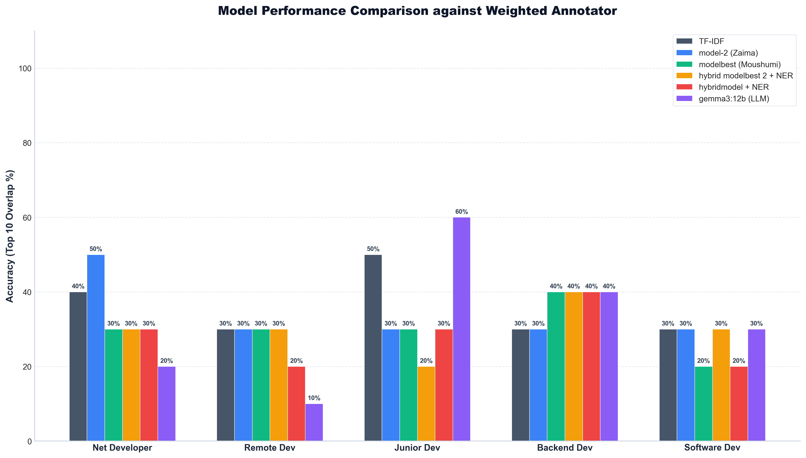

# Model Performance and Accuracy Comparison Report (Weighted Annotator)

This report evaluates the accuracy of 6 different ranking models against the **Weighted Annotator** (33.33% Annotator 1 Rank + 66.67% Annotator 2 Rank) across all 5 projects.

## Evaluation Methodology
- **Top 10 Accuracy**: For each project, the top 10 CV files returned by a model are compared against the top 10 CV files defined by the Weighted Annotator. Accuracy is the count of overlapping files in both lists (represented as a score out of 10 and percentage).
- **Tie-Breaking**: When sorting files for Annotators or Models, ties are resolved deterministically by numeric filename index (e.g. `1.docx` before `2.docx`). For Annotators, ties are first resolved by using their `Weighted Rank`.

---

## Overall Accuracy Summary (Top 10 Overlap)

| Project Name | Evaluator | TF-IDF | model-2 (Zaima Apu) | modelbest (Moushumi Apu) | hybrid modelbest 2 (Zaima Apu)2+ner | hybridmodel(Moushumi Apu)+ner | gemma3:12b (LLM Rubric) |
|---|---|---|---|---|---|---|---|
| **Software Developer - .Net** | Weighted Annotator | 4/10 (40%) | 5/10 (50%) | 3/10 (30%) | 3/10 (30%) | 3/10 (30%) | 2/10 (20%) |
| **Remote Software Developer** | Weighted Annotator | 3/10 (30%) | 3/10 (30%) | 3/10 (30%) | 3/10 (30%) | 2/10 (20%) | 1/10 (10%) |
| **Junior Level Software Developer (1-4 years experience)** | Weighted Annotator | 5/10 (50%) | 3/10 (30%) | 3/10 (30%) | 2/10 (20%) | 3/10 (30%) | 6/10 (60%) |
| **Backend Software Developer** | Weighted Annotator | 3/10 (30%) | 3/10 (30%) | 4/10 (40%) | 4/10 (40%) | 4/10 (40%) | 4/10 (40%) |
| **Software Developer** | Weighted Annotator | 3/10 (30%) | 3/10 (30%) | 2/10 (20%) | 3/10 (30%) | 2/10 (20%) | 3/10 (30%) |

## Visual Comparison Chart

### Weighted Annotator Comparison

---

## Detailed Project Breakdown

### Software Developer - .Net

- **Weighted Annotator Top 10**: 24.docx, 25.docx, 21.docx, 23.docx, 26.docx, 28.docx, 30.docx, 4.docx, 6.docx, 20.docx

| Model | Evaluator | Accuracy | Common CVs |
|---|---|---|---|
| tf/idf | Weighted Annotator | 4/10 (40%) | 4.docx, 20.docx, 25.docx, 28.docx |
| model-2 (Zaima Apu) | Weighted Annotator | 5/10 (50%) | 4.docx, 20.docx, 21.docx, 25.docx, 26.docx |
| modelbest (Moushumi Apu) | Weighted Annotator | 3/10 (30%) | 4.docx, 21.docx, 26.docx |
| hybrid modelbest 2 (Zaima Apu)2+ner | Weighted Annotator | 3/10 (30%) | 20.docx, 21.docx, 25.docx |
| hybridmodel(Moushumi Apu)+ner | Weighted Annotator | 3/10 (30%) | 4.docx, 21.docx, 25.docx |
| gemma3:12b (LLM Rubric) | Weighted Annotator | 2/10 (20%) | 25.docx, 26.docx |

---

### Remote Software Developer

- **Weighted Annotator Top 10**: 29.docx, 10.docx, 22.docx, 16.docx, 17.docx, 30.docx, 7.docx, 18.docx, 19.docx, 5.docx

| Model | Evaluator | Accuracy | Common CVs |
|---|---|---|---|
| tf/idf | Weighted Annotator | 3/10 (30%) | 16.docx, 18.docx, 29.docx |
| model-2 (Zaima Apu) | Weighted Annotator | 3/10 (30%) | 17.docx, 18.docx, 22.docx |
| modelbest (Moushumi Apu) | Weighted Annotator | 3/10 (30%) | 17.docx, 18.docx, 22.docx |
| hybrid modelbest 2 (Zaima Apu)2+ner | Weighted Annotator | 3/10 (30%) | 5.docx, 7.docx, 17.docx |
| hybridmodel(Moushumi Apu)+ner | Weighted Annotator | 2/10 (20%) | 7.docx, 29.docx |
| gemma3:12b (LLM Rubric) | Weighted Annotator | 1/10 (10%) | 5.docx |

---

### Junior Level Software Developer (1-4 years experience)

- **Weighted Annotator Top 10**: 6.docx, 10.docx, 20.docx, 1.docx, 27.docx, 4.docx, 9.docx, 29.docx, 3.docx, 12.docx

| Model | Evaluator | Accuracy | Common CVs |
|---|---|---|---|
| tf/idf | Weighted Annotator | 5/10 (50%) | 1.docx, 4.docx, 12.docx, 20.docx, 29.docx |
| model-2 (Zaima Apu) | Weighted Annotator | 3/10 (30%) | 4.docx, 12.docx, 27.docx |
| modelbest (Moushumi Apu) | Weighted Annotator | 3/10 (30%) | 4.docx, 12.docx, 27.docx |
| hybrid modelbest 2 (Zaima Apu)2+ner | Weighted Annotator | 2/10 (20%) | 12.docx, 29.docx |
| hybridmodel(Moushumi Apu)+ner | Weighted Annotator | 3/10 (30%) | 1.docx, 12.docx, 29.docx |
| gemma3:12b (LLM Rubric) | Weighted Annotator | 6/10 (60%) | 1.docx, 4.docx, 6.docx, 12.docx, 27.docx, 29.docx |

---

### Backend Software Developer

- **Weighted Annotator Top 10**: 8.docx, 9.docx, 2.docx, 12.docx, 13.docx, 14.docx, 15.docx, 16.docx, 17.docx, 19.docx

| Model | Evaluator | Accuracy | Common CVs |
|---|---|---|---|
| tf/idf | Weighted Annotator | 3/10 (30%) | 12.docx, 14.docx, 17.docx |
| model-2 (Zaima Apu) | Weighted Annotator | 3/10 (30%) | 12.docx, 14.docx, 17.docx |
| modelbest (Moushumi Apu) | Weighted Annotator | 4/10 (40%) | 2.docx, 12.docx, 14.docx, 17.docx |
| hybrid modelbest 2 (Zaima Apu)2+ner | Weighted Annotator | 4/10 (40%) | 12.docx, 14.docx, 15.docx, 17.docx |
| hybridmodel(Moushumi Apu)+ner | Weighted Annotator | 4/10 (40%) | 2.docx, 12.docx, 14.docx, 17.docx |
| gemma3:12b (LLM Rubric) | Weighted Annotator | 4/10 (40%) | 2.docx, 12.docx, 14.docx, 16.docx |

---

### Software Developer

- **Weighted Annotator Top 10**: 18.docx, 3.docx, 11.docx, 24.docx, 1.docx, 21.docx, 5.docx, 29.docx, 10.docx, 20.docx

| Model | Evaluator | Accuracy | Common CVs |
|---|---|---|---|
| tf/idf | Weighted Annotator | 3/10 (30%) | 1.docx, 20.docx, 21.docx |
| model-2 (Zaima Apu) | Weighted Annotator | 3/10 (30%) | 18.docx, 20.docx, 21.docx |
| modelbest (Moushumi Apu) | Weighted Annotator | 2/10 (20%) | 18.docx, 21.docx |
| hybrid modelbest 2 (Zaima Apu)2+ner | Weighted Annotator | 3/10 (30%) | 1.docx, 11.docx, 24.docx |
| hybridmodel(Moushumi Apu)+ner | Weighted Annotator | 2/10 (20%) | 1.docx, 11.docx |
| gemma3:12b (LLM Rubric) | Weighted Annotator | 3/10 (30%) | 1.docx, 3.docx, 5.docx |

---
